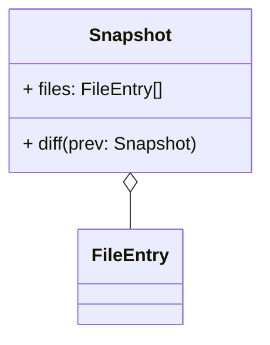
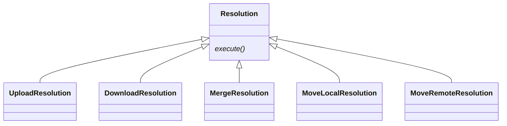
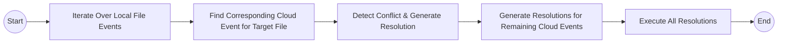
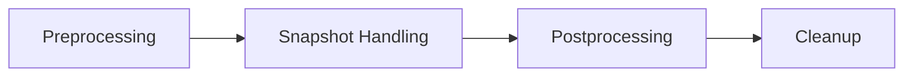

Sync Vault delivers file-level conflict detection and resolution capabilities. This is the second article explaining its technical fundamentals—focused on how cloud events are identified, processed, and resolved.

In the previous article, [[local file events | Handling Local Events]], we explored the triggering mechanisms, characteristics, and processing methods for local events in Obsidian. We concluded that a sync with the cloud is initiated after `create`, `modify`, `delete`, or `rename` events occur.

Before diving in, let’s address a critical question: What if cloud files also change during this process? This article answers that by covering cloud event recognition, conflict identification, and resolution strategies.

## Retrieving Cloud Events
For synchronization, we care about four core file events: create, modify, delete, and move—applying equally to cloud files.

Cloud event retrieval depends on the cloud service’s capabilities, falling into two scenarios:

1. **Cloud services with change-tracking APIs**: Services like OneDrive offer Delta APIs to query changes since the last sync, or webhooks to notify clients of file updates. This greatly simplifies sync implementation.
2. **Storage-only cloud services**: Services like Baidu NetDisk or Alibaba Cloud Disk only provide basic file storage (no change-tracking APIs). Below, we focus on sync implementation for this scenario.

### File Representation
We use a `FileEntry` interface to model file objects, with `fsid` as the critical unique identifier (unchanged even if the file is modified or moved):

```ts
interface FileEntry {
  path: string; // Absolute file path
  isdir: boolean;
  fsid: string; // Immutable unique ID
  parentFileId?: string;
  ctime: number; /* Creation time (seconds) */
  mtime: number; /* Modification time (seconds) */
  size: number; /* File size (bytes) */
}
```

### Cloud Snapshot at Any Time
A `Snapshot` type represents the cloud’s file state at a specific moment, composed of `FileEntry` objects:

### Identifying Cloud Changes

Cloud changes are derived by comparing two consecutive snapshots:`cloudChanges = diff(currentCloudSnapshot, prevCloudSnapshot)`

The table below outlines how to detect specific events:

|File Event|Detection Logic (Between Two Snapshots)|
|---|---|
|Move|Same `fsid`, different `path`|
|Delete|File path exists in the previous snapshot but not the current one|
|Modify|Same `path` + (different cloud hash (ideal) OR changed `mtime`/`size` (fallback))|

> [!note] Special Case: Cloud File Creation
> Instead of comparing two cloud snapshots, we directly compare the current cloud snapshot with local files. If a cloud file’s path does not exist locally, it is a newly created cloud file.

## Processing Cloud Events

We implement an `apply` method to handle cloud events. From [[local file events | Handling Local Events]], we already have preprocessed local file events stored in `historyEvents`—a collection of `FileEvent` objects:

```ts
interface FileEvent {
  type: FileEventTypeEnum; /* create/modify/delete/move */
  targetPath: string;
  isDir: boolean;
  oldPath?: string; /* For rename events */
  timestamp: number;
  mark: ResolveStatus; /* For conflict resolution */
}
```

### Sync State Initialization & Conflict Detection

> [!important] Conflict detection by reconciling local and cloud events is the cornerstone of reliable synchronization.

#### Step 1: Sync State Initialization

At the start of each sync:

1. Generate the union of local and cloud files.
2. Set initial states:
    - Local-only files: `LocalCreated`
    - Cloud-only files: `RemoteCreated`
    - Files existing in both: Use `checkFileNodeSyncStatus(localFile, remoteFile)` to determine initial sync state.

#### Step 2: Conflict Detection

Local and cloud events are stored in separate Maps (key: file path, value: event). Conflicts are identified by reconciling these events, with the following pseudo-code:`resolve(localEvent, remoteEvent): Resolution`

We define 5 `Resolution` types to dictate how conflicts are resolved (each implementing an `execute()`method):



The table below maps event combinations to corresponding resolutions (for multi-device sync):

| Local Event \ Cloud Event | Modify                | Move                  | Delete      |
| ------------------------- | --------------------- | --------------------- | ----------- |
| Modify                    | Merge                 | MoveLocal + Upload    | Upload      |
| Move                      | MoveRemote + Download | Download + Upload[^1] | Upload[^2]  |
| Delete                    | Download[^3]          | Download              | No Conflict |

#### Step 3: Conflict Resolution Workflow



#### Step 4: Post-Resolution State Updates
After resolving conflicts, file sync states are updated as follows:

|Resolution Type|Action & State Update|
|---|---|
|Upload|Upload local file; mark as `Synced`|
|Download|Download cloud file; update local state|
|Merge|Fetch cloud content; merge with local file|
|MoveLocal|Move local file; mark as `Synced`|
|MoveRemote|Move cloud file; mark as `Synced`|

Files remaining in `LocalCreated` or `RemoteCreated` states are genuine new files and are synced directly (upload/download).

## Sync Workflow Summary
The complete sync process consists of 4 stages:



1. **Preprocessing**: Fetch the latest cloud snapshot and initialize sync states.
2. **Snapshot Handling**: Detect cloud changes, identify conflicts, and execute resolutions.
3. **Postprocessing**: Sync unprocessed files (genuine new files).
4. **Cleanup**: Reset temporary states and prepare for the next sync cycle.

This file-level conflict resolution mechanism enables reliable sync across storage-only cloud services. For finer-grained collaboration (e.g., real-time co-editing), advanced techniques like CRDTs are required. Sync Vault implements CRDTs to bring collaborative editing to Obsidian—stay tuned for our next article!
## Footnotes
[^1]: Conflict occurs if files are moved to different paths; both versions are preserved if conflicting. No conflict if moved to the same path.
[^2]: Local file is preserved (priority to local changes).
[^3]: Local deletion is overwritten; cloud file is downloaded (priority to cloud changes for modify events).