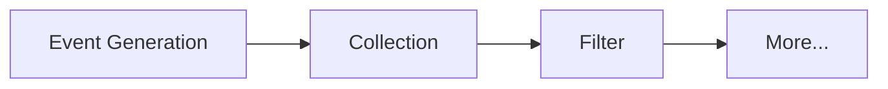

During multi-device synchronization, two major types of events need to be handled: **Local File Changes** and **Cloud File Changes**. Event handling plays a core role in the synchronization algorithm—subsequent synchronization actions such as upload, download, delete, rename, move, and merge are all based on the results of event processing.

In Obsidian, synchronization involves 4 types of events:

1. Create a file or folder.
2. Rename a file or folder.
3. Delete a file or folder.
4. Modify a file.

The above are the four event types concerned during synchronization, each corresponding to relevant user operations in Obsidian.

## The Event Types

File change events are monitored using the `vault.on()` method:

```ts
vault.on('create', () => {}) // New file/folder created
vault.on('rename', () => {}) // Rename (move)
vault.on('delete', () => {}) // File/folder deleted
vault.on('modify', () => {}) // File modified
```

> [!note] code-level monitoring
> Additionally, this can be implemented through method patching using tools like `cross`. This approach has not been explored yet—all content below is described based on events triggered by `vault.on`.

After understanding how to listen to events, let’s examine the characteristics of these four event types to implement appropriate handling. Correctly recognizing the uniqueness of each event is essential for designing effective solutions.
## Characteristics of Events
### 1. Create Event
- **TriggerBy**: When the user creates a new file or folder.
- **Characteristic**: Since a user can only create one file/folder at a time, one creation operation corresponds to exactly one create event.
### 2. Rename Event
- **TriggerBy**: (1) Clicking to rename a file/folder; (2) Moving a file/folder to another location.
- **Characteristic**: When renaming or moving a folder, rename events are triggered for the folder itself and all its sub-items. The event order follows a **breadth-first traversal**—first the folder itself, then its direct children, and so on.
### 3. Delete Event
- **TriggerBy**: When the user deletes a file or folder.
- **Characteristic**: When deleting a folder, delete events are triggered for the folder and all its sub-items. However, unlike rename events, there is **no distinct order**—events are basically triggered in bulk simultaneously.
### 4. Modify Event
- **TriggerBy**: When the user modifies file content.
- **Characteristic**: Only triggered when file content changes; folders never trigger this event.
## Collection and Preprocessing

Create and modify events do not require additional preprocessing because each operation maps to a single event. However, renaming or deleting folders presents special challenges. For example:If you delete folder `A` which contains subfolder `A-1`, suppose the delete events are triggered in the order:

1. Delete folder `A`
2. Delete folder `A-1`

Directly executing these events on the cloud would result in:

- Deleting cloud folder `A`
- Attempting to delete cloud folder `A-1` (which no longer exists), causing an invalid operation.

> [!note] Deleting or moving a large folder generates numerous invalid operations. Therefore, preprocessing is necessary before sending requests to the cloud.

Additionally, event collection poses a problem. Using the delete example above, we need to collect both the "delete `A`" and "delete `A-1`" events, filter redundant operations, and finally send a single "delete `A`" request to the cloud. However, we cannot assume the order or interval of event triggers.

### Solutions:

- **For delete events**: In typical scenarios, delete events occur in bulk with intervals of just a few milliseconds. Therefore, the `debounce` method can be used to delay processing and collect events within a specified window.
- **For rename events**: Since events follow a specific order, we can check if a parent file/folder is already being processed. If so, the child item's event can be ignored.

Here we get the basic workflow for handling local file events:

Example code for event collection and filtering:
```ts
debounce(() => {
	// Event preprocessing: fileEventTemp stores raw events as a queue
	this.fileEventTemp.sort((a, b) => {
		if (a.timestamp !== b.timestamp) {
			return a.timestamp - b.timestamp;
		} else {
			return a.targetPath.length - b.targetPath.length;
		}
});
	// historyEvents stores preprocessed events
	const historyEvents: FileEvent[] = [];
	let nextEvent = this.fileEventTemp.shift();

	while (nextEvent) {
		if (historyEvents.some(e => nextEvent?.targetPath.startsWith(e.targetPath))) {
			logger.info(`Ignore event: ${nextEvent}`);
		} else {
			historyEvents.push(nextEvent);
		}
		nextEvent = this.fileEventTemp.shift();
	}
}, 1000, true)(); // Delay 1 second to collect events from the last second into fileEventTemp
```

## Compact Events
Consider this scenario: File `A` is renamed to `B`, then renamed again to `C`. This generates two rename events:

1. Rename `A` → `B`
2. Rename `B` → `C`

During preprocessing, both events are collected. In reality, these two events can be merged into one:3. Rename `A` → `C`

Sync Vault supports chained aggregation of rename events to reduce the number of cloud requests.

After local event preprocessing is complete, the actual [[Synchronization Flow]] is triggered.