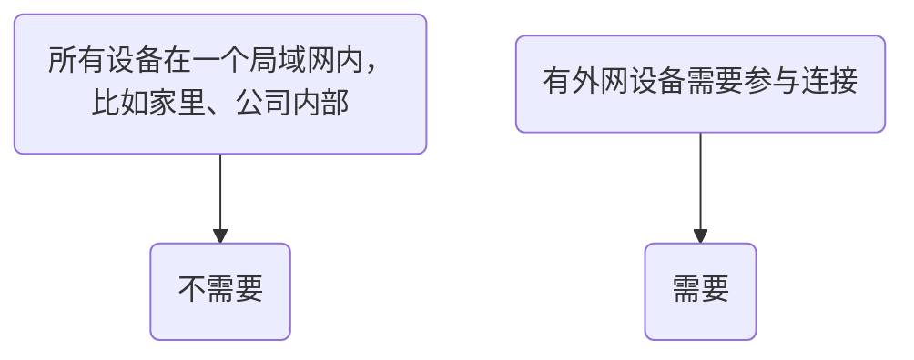

## 什么是TURN服务器？
**TURN服务器是一个在网络“防火墙”或“NAT”后面设备之间建立直接通信的“中转站”或“翻译官”。** 当两个设备无法直接“握手”对话时，它们的所有聊天内容都通过这个中转站进行 relay（中继/转发）。

## 我是不是需要TURN服务器？

基于[[build-turn-server-with-corturn|Corturn搭建TURN服务器]]可以快速实现TURN服务器搭建，NAS用户可以参考[[build-with-nas|基于NAS搭建]]。