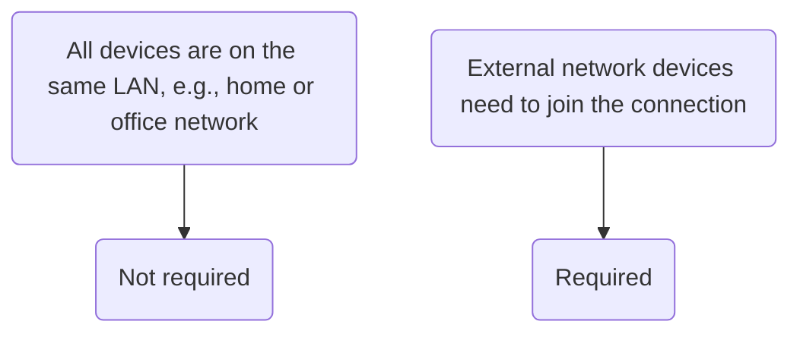

# What is a TURN Server?

A **TURN server** acts as a "relay station" or "translator" that enables direct communication between devices behind network "firewalls" or "NAT". When two devices cannot establish a direct "handshake" connection, all their data is relayed through this intermediate server. When using [[peer-to-peer-livesync | Real-Time Sync]], if devices fail to discover each other directly, a TURN server is required for data relay.

## Do I Need a TURN Server?


You can quickly set up a TURN server by [[build-turn-server-with-corturn|Setting Up a TURN Server with Coturn]]. For NAS users, refer to [[build-with-nas|Setting Up on NAS]].

## Setting Up a Relay Service with Coturn

Coturn is a powerful open-source STUN/TURN server.

### 1. Preparation

Before starting, you need:

- A server with a **public IP address** (e.g., a cloud server).
- A recent Linux distribution (e.g., Ubuntu 20.04/22.04 LTS) installed on the server.

**Network Port Requirements**:

- **3478 TCP/UDP**: Standard port for STUN/TURN services.
- **5349 TCP/UDP**: TLS-encrypted port for TURN services.
- **49152-65535 UDP**: Port range for relaying media streams (adjustable if needed).

Ensure your server firewall (e.g., `ufw`) or cloud provider’s security group rules allow the above ports. For example, on Ubuntu with UFW, run the following commands:

bash

```bash
sudo ufw allow 3478/udp
sudo ufw allow 3478/tcp
sudo ufw allow 5349/udp
sudo ufw allow 5349/tcp
sudo ufw allow 49152:65535/udp # Open relay port range
sudo ufw reload
```

### 2. Installation

**On Ubuntu/Debian, install using the apt package manager**:

bash

```bash
sudo apt update
sudo apt install coturn
```

### 3. Configuring Coturn

Coturn’s main configuration file is typically `/etc/turnserver.conf` or `/usr/local/etc/turnserver.conf`. It is recommended to back up the original file first.

|Configuration Item|Example Value|Description|
|---|---|---|
|`listening-ip`|`0.0.0.0`|IP address the server listens on; `0.0.0.0` means all available network interfaces.|
|`listening-port`|`3478`|UDP/TCP port for STUN/TURN services.|
|`tls-listening-port`|`5349`|TLS-encrypted port for TURN services.|
|`external-ip`|`Your Public IP`|**Critical!** Your server’s public IP. If the server has multiple IPs or is behind NAT, use the format `Public IP/Private IP`.|
|`relay-ip`|`Server Private IP`|IP used for relaying traffic (usually the server’s private IP).|
|`min-port`<br><br>`max-port`|`49152`<br><br>`65535`|UDP port range for TURN relay. Must match firewall settings.|
|`user`|`username:password`|Username and password for long-term credential authentication (plaintext, for testing).|
|`realm`|`yourdomain.com`|Realm identifier (usually your domain or server’s public IP), used for client connections.|
|`lt-cred-mech`|(No value)|Enables long-term credential authentication.|
|`fingerprint`|(No value)|Adds a fingerprint attribute to STUN/TURN messages for enhanced security.|
|`cert`<br><br>`pkey`|`/etc/ssl/turn_cert.pem`<br><br>`/etc/ssl/turn_key.pem`|Paths to TLS certificate and private key (supports Let’s Encrypt or self-signed certificates).|
|`no-tlsv1`<br><br>`no-tlsv1_1`|(No value)|Disables insecure TLS protocol versions.|
|`log-file`|`/var/log/turn.log`|Path to log file (facilitates troubleshooting).|
|`verbose`|(No value)|Enables detailed log output.|

A basic configuration file example (`/etc/turnserver.conf`):

ini

```ini
# Network Listening Configuration
listening-ip=0.0.0.0
listening-port=3478
tls-listening-port=5349
external-ip=Your Public IP Address # e.g., 123.456.789.123
relay-ip=Your Private IP Address   # e.g., 172.31.0.10

# Relay Port Range
min-port=49152
max-port=65535

# Domain and Authentication
realm=Your Domain or Server Public IP # e.g., turn.yourdomain.com
lt-cred-mech
user=Your Username:Your Password # Long-term credential (plaintext, for testing)
# It is recommended to use turnadmin to create dynamic users:cite[2]
# Or use use-auth-secret and static-auth-secret:cite[2]

# Security and TLS
fingerprint
cert=/etc/ssl/turn_cert.pem    # Path to TLS certificate
pkey=/etc/ssl/turn_key.pem     # Path to TLS private key
no-tlsv1
no-tlsv1_1
cipher-list="DEFAULT"          # List of encryption suites:cite[8]

# Logs
log-file=/var/log/turn.log
verbose # Disable in production to avoid excessive log size

# Others
stale-nonce
no-multicast-peers
no-cli:cite[8]
```

### 4. Starting and Testing

**Start the Coturn service**:If installed via `apt`, Coturn is set up as a systemd service. Start and enable it with:

sh

```sh
sudo systemctl start coturn    # Start the service
sudo systemctl enable coturn   # Set to start on boot:cite[10]
```

**Check service status and logs**:Verify if Coturn is running properly with these commands:

sh

```sh
sudo systemctl status coturn   # Check service status
sudo tail -f /var/log/turn.log # View real-time logs (if log-file is configured):cite[10]
netstat -tuln | grep -E ':(3478|5349)' # Check if ports are listening
```

**Test the TURN server**:**Online Tool Test**:Google provides a convenient **WebRTC ICE Candidate Collection Test Page**:

1. Open a browser and visit: [https://webrtc.github.io/samples/src/content/peerconnection/trickle-ice/](https://webrtc.github.io/samples/src/content/peerconnection/trickle-ice/)
2. In the `IceServers` box, delete the default content and add your TURN server information in the following format:
    
    json
    
    ```json
    {
      "urls": "turn:Your Public IP:3478",
      "username": "Your Username",
      "credential": "Your Password"
    }
    ```
    

### 5. Sync Vault Configuration

Open **Sync Settings** > **Self-Hosted Configuration**, and enter the TURN server details in the input box:

sh

```sh
// Format: turn:host:port?username=xxx&password=xxx
```

Click the cloud icon to automatically establish a peer-to-peer connection.

## Setting Up a Relay Service on NAS

A **NAS** is an excellent platform for hosting a TURN server, especially for home labs or personal projects. Its 24/7 operation and low power consumption make it ideal for running such persistent services.

[[#Setting Up a Relay Service with Coturn]] covers Coturn-based TURN server setup. For NAS deployment, there are three main methods depending on your NAS model and system:

|Method|Applicable Scenarios|Advantages|Disadvantages|
|---|---|---|---|
|**Docker**|**Most modern NAS (Synology, QNAP, ASUSTOR, etc.)**|**Highly recommended!** Easy deployment, good isolation, no system pollution, easy management and migration.|Requires basic Docker knowledge|
|**Native Install**|Linux-based NAS supporting `apt` or `pkg` (e.g., TrueNAS Scale)|Slightly better performance, direct control|May depend on system version, risk of conflicts with other system components|
|**Virtual Machine**|All NAS supporting virtualization|Full isolation, maximum flexibility|Higher resource consumption, more complex setup|

> 🎈 **Docker-based setup is recommended**This is the simplest and most secure method, suitable for most NAS brands like Synology (DSM), QNAP, and ASUS.

### 1. Preparation

- **Enable SSH access**: Activate SSH in your NAS control panel to execute commands via the terminal.
- **Install Docker**: Search for and install the **Docker** app (e.g., Synology’s "Container Manager") in your NAS’s Package Center or App Center.
- **Plan file paths**: Create a folder on your NAS to store Coturn’s configuration files and logs (e.g., `/docker/coturn`).

### 2. Create a Configuration File

Connect to your NAS via SSH or use the NAS’s built-in text editor to create a file named `turnserver.conf` in the folder you just created (e.g., `/docker/coturn`):

sh

```sh
# Navigate to the directory and create the file
cd /volume1/docker/coturn
vim turnserver.conf
```

Paste the following configuration content into the file, and **modify the parts marked in comments according to your setup**:

ini

```ini
# Basic Configuration
listening-port=3478
tls-listening-port=5349
min-port=10000
max-port=20000

# ！！！Critical Step: Enter your public IP or DDNS domain ！！！
external-ip=Your Public IP or DDNS Domain

# Authentication Configuration (use long-term credentials; modify the password)
lt-cred-mech
user=Your Username:Your Password
realm=Your Public IP or DDNS Domain

# Network and Security Configuration
fingerprint
verbose
no-multicast-peers

# If your NAS has multiple IPs, specify relay-ip (optional)
# relay-ip=Your NAS Private IP

# Log Output (optional)
log-file=/var/log/turn.log
simple-log
```

### 3. Start the Docker Container

Create the container using your NAS’s Docker GUI (e.g., Container Manager) or via SSH command line.

**GUI Operation Steps**:

1. Open **Container Manager**.
2. Go to "Registry", search for `coturn`, and download the official image `coturn/coturn`.
3. After download, find the image in "Images" and click "Launch".
4. In "Advanced Settings":
    - **Network**: Select "Use the same network as Docker Host" (`host` network mode) to avoid complex port mapping.
    - **Volumes**: Add a folder mapping—mount `/docker/coturn/turnserver.conf` (on your NAS) to `/etc/coturn/turnserver.conf` (inside the container).
    - **Environment Variables** (optional): Add `TURNSERVER_ENABLED=1`.
5. Complete the setup and run the container.

**SSH Command Line Example (More Efficient)**:

bash

```bash
docker run -d \
  --name=coturn \
  --network=host \
  --restart=always \
  -v /volume1/docker/coturn/turnserver.conf:/etc/coturn/turnserver.conf \
  coturn/coturn
```

- `-d`: Run in the background
- `--name=coturn`: Name the container "coturn"
- `--network=host`: Use host network mode to simplify network configuration
- `--restart=always`: Auto-restart the container if the NAS reboots
- `-v ...`: Mount the local configuration file to the container