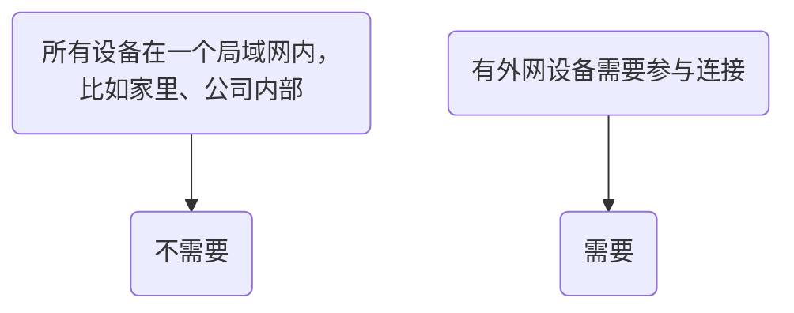

## 什么是TURN服务器？
**TURN服务器是一个在网络“防火墙”或“NAT”后面设备之间建立直接通信的“中转站”或“翻译官”。** 当两个设备无法直接“握手”对话时，它们的所有聊天内容都通过这个中转站进行 relay（中继/转发）。在使用 [[peer-to-peer-livesync | 实时同步]] 的时候，如果设备无法直接发现对方，则需要通过TURN服务中转。

## 我是不是需要TURN服务器？

基于[[build-turn-server-with-corturn|Corturn搭建TURN服务器]]可以快速实现TURN服务器搭建，NAS用户可以参考[[build-with-nas|基于NAS搭建]]。
## 通过Corturn搭建中转服务
Coturn是一款功能强大的开源STUN/TURN服务器。
### 1 准备
在开始之前，你需要准备一台具有**公网IP地址**的服务器（如云服务器），并确保服务器系统为较新版本的Linux发行版（如Ubuntu 20.04/22.04 LTS）。
**网络端口要求：**
- **3478 TCP/UDP**：STUN/TURN服务的标准端口。
- **5349 TCP/UDP**：TLS加密的TURN服务端口。
- **49152-65535 UDP**：中继传输媒体流使用的端口范围（可根据需要调整）。

请确保你的服务器防火墙（如`ufw`）或云服务商的安全组规则已开放上述端口。例如，在Ubuntu上使用UFW时，可以运行以下命令：
```bash
sudo ufw allow 3478/udp
sudo ufw allow 3478/tcp
sudo ufw allow 5349/udp
sudo ufw allow 5349/tcp
sudo ufw allow 49152:65535/udp # 开放中继端口范围
sudo ufw reload
```

### 2 安装
**在Ubuntu/Debian上，可以使用apt包管理器安装：**

```bash
sudo apt update
sudo apt install coturn
```

### 3 配置Corturn
Coturn的主要配置文件通常是 `/etc/turnserver.conf` 或 `/usr/local/etc/turnserver.conf`。建议先备份原始文件。

配置项及其说明：

| 配置项                          | 示例值                                                   | 说明                                                       |
| ---------------------------- | ----------------------------------------------------- | -------------------------------------------------------- |
| `listening-ip`               | `0.0.0.0`                                             | 服务器监听的IP地址，`0.0.0.0`表示监听所有可用网络接口。                        |
| `listening-port`             | `3478`                                                | STUN/TURN服务监听的UDP和TCP端口。                                 |
| `tls-listening-port`         | `5349`                                                | TLS加密TURN服务监听的端口。                                        |
| `external-ip`                | `你的公网IP`                                              | **非常重要**！你的服务器公网IP地址。如果服务器有多个IP或位于NAT后，格式可为 `公网IP/内网IP`。 |
| `relay-ip`                   | `服务器内网IP`                                             | 中继流量使用的IP地址，通常设置为服务器内网IP。                                |
| `min-port`  <br>`max-port`   | `49152`  <br>`65535`                                  | 定义TURN服务器用于中继的UDP端口范围。需与防火墙设置匹配。                         |
| `user`                       | `username:password`                                   | 定义长期凭证机制的用户名和密码（明文方式，测试可用）。                              |
| `realm`                      | `yourdomain.com`                                      | Realm标识，通常设为你的域名或服务器公网IP。客户端连接时会用到。                      |
| `lt-cred-mech`               | (无值)                                                  | 启用长期凭证认证机制。                                              |
| `fingerprint`                | (无值)                                                  | 增加STUN/TURN消息中的指纹属性，增强安全性。                               |
| `cert`  <br>`pkey`           | `/etc/ssl/turn_cert.pem`  <br>`/etc/ssl/turn_key.pem` | TLS证书和私钥的文件路径。可使用Let's Encrypt证书或自签名证书。                  |
| `no-tlsv1`  <br>`no-tlsv1_1` | (无值)                                                  | 禁用不安全的TLS协议版本。                                           |
| `log-file`                   | `/var/log/turn.log`                                   | 指定日志文件路径，便于排查问题。                                         |
| `verbose`                    | (无值)                                                  | 启用详细日志输出。                                                |
一个基础的配置文件示例（`/etc/turnserver.conf`）如下：
```ini
# 网络监听配置
listening-ip=0.0.0.0
listening-port=3478
tls-listening-port=5349
external-ip=你的公网IP地址 # 例如 123.456.789.123
relay-ip=你的内网IP地址    # 例如 172.31.0.10

# 中继端口范围
min-port=49152
max-port=65535

# 域名和认证
realm=你的域名或服务器公网IP # 例如 turn.yourdomain.com
lt-cred-mech
user=你的用户名:你的密码 # 长期凭证（明文，用于测试）
# 更推荐使用 turnadmin 创建动态用户:cite[2]
# 或者使用 use-auth-secret 和 static-auth-secret:cite[2]

# 安全与TLS
fingerprint
cert=/etc/ssl/turn_cert.pem    # TLS证书路径
pkey=/etc/ssl/turn_key.pem     # TLS私钥路径
no-tlsv1
no-tlsv1_1
cipher-list="DEFAULT"          # 加密套件列表:cite[8]

# 日志
log-file=/var/log/turn.log
verbose # 生产环境可考虑关闭以避免日志过大

# 其他
stale-nonce
no-multicast-peers
no-cli:cite[8]
```
### 4 启动与测试
**启动Coturn服务：**  
如果你使用`apt`安装，Coturn已经作为systemd服务安装。你可以这样启动和启用它：
```sh
sudo systemctl start coturn    # 启动服务
sudo systemctl enable coturn   # 设置开机自启:cite[10]
```
**检查服务状态和日志：**  
使用以下命令检查Coturn是否正常运行：
```sh
sudo systemctl status coturn   # 查看服务状态
sudo tail -f /var/log/turn.log # 实时查看日志（如果配置了log-file）:cite[10]
netstat -tuln | grep -E ':(3478|5349)' # 检查端口是否监听成功
```
**测试TURN服务器：**
**在线工具测试：**  
谷歌提供了一个非常方便的**WebRTC ICE候选收集测试页面**：
1. 打开浏览器，访问：[https://webrtc.github.io/samples/src/content/peerconnection/trickle-ice/](https://webrtc.github.io/samples/src/content/peerconnection/trickle-ice/)
2. 在 `IceServers` 框内，删除默认内容，添加你的TURN服务器信息，格式如下：
	```json
		{
		  "urls: "turn:你的公网IP:3478",
		  "username": "你的用户名",
		  "credential": "你的密码"
		}
		```
### 5. Sync Vault配置
打开【同步设置】-【自部署配置】，在TURN服务器输入框中填入：
```sh
// 格式如 turn:host:port?username=xxx&password=xxx
```
点击云朵图标将自动进行点对点连接。
## 在NAS上搭建中转服务
**NAS是搭建TURN服务器的绝佳平台**，尤其是对于家庭实验室或个人项目。它24/7开机、低功耗的特性非常适合运行这种需要常驻的服务。

[[#通过Corturn搭建中转服务]] 介绍了Corturn搭建Turn服务器的方法。在NAS上搭建，
根据NAS型号和系统，主要有以下三种方式：

|方法|适用场景|优点|缺点|
|---|---|---|---|
|**Docker**|**绝大多数现代NAS（群晖、QNAP、威联通等）**|**最推荐！** 部署简单、隔离性好、不污染系统、易于管理和迁移|需要基本了解Docker概念|
|**原生安装**|支持`apt`或`pkg`的Linux系统NAS（如TrueNAS Scale）|性能稍好、直接控制|可能依赖系统版本、易与系统其他组件冲突|
|**虚拟机**|所有支持虚拟化的NAS|完全隔离、灵活性最高|

> 🎈推荐基于Docker搭建

这是最简洁、最安全的方式，适用于群晖（DSM）、QNAP、华硕等大多数品牌NAS。

### 1. 前期准备

- **启用SSH访问**：在NAS控制面板中启用SSH功能，以便通过终端执行命令。
- **安装Docker**：在NAS的套件中心或App Center中搜索并安装 **Docker** 应用（如群晖的 "Container Manager"）。
- **规划路径**：在NAS上创建一个文件夹用于存放Coturn的配置文件和日志，例如 `/docker/coturn`。
### 2. 创建配置文件

通过SSH连接到你的NAS，或者使用NAS的文本编辑器，在你刚创建的目录下（如 `/docker/coturn`）新建一个名为 `turnserver.conf` 的文件。

```sh
# 进入目录并创建文件
cd /volume1/docker/coturn
vim turnserver.conf
```

将以下配置内容粘贴到文件中，**务必根据你的情况修改注释标注的部分**：

```ini
# 基础配置
listening-port=3478
tls-listening-port=5349
min-port=10000
max-port=20000

# ！！！最重要的一步：填写你的公网IP或DDNS域名 ！！！
external-ip=你的公网IP或DDNS域名

# 认证配置（使用长期凭证机制，密码建议修改）
lt-cred-mech
user=你的用户名:你的密码
realm=你的公网IP或DDNS域名

# 网络和安全配置
fingerprint
verbose
no-multicast-peers

# 如果你的NAS有多个IP，可能需要指定 relay-ip
# relay-ip=你的NAS内网IP

# 日志输出（可选）
log-file=/var/log/turn.log
simple-log
```

### 3. 启动Docker容器

使用NAS的Docker图形化界面（如Container Manager）或通过SSH命令行创建容器。

**图形界面操作流程：**

1. 打开 **Container Manager**。
2. 点击“注册表”，搜索 `coturn`，选择官方镜像 `coturn/coturn` 并下载。
3. 下载完成后，在“映像”中找到它，点击“启动”。
4. 在“高级设置”中：
    - **网络**：选择“使用与Docker Host相同的网络”模式（`host`网络），这是最简单的方式，能避免复杂的端口映射。    
    - **卷**：添加一个文件夹映射，将你在NAS上创建的 `/docker/coturn/turnserver.conf` 挂载到容器内的 `/etc/coturn/turnserver.conf`。
    - **环境变量**（可选）：可以添加 `TURNSERVER_ENABLED=1`。
5. 完成设置并运行容器。
    
**SSH命令行操作示例（更高效）：**

```bash

docker run -d \
  --name=coturn \
  --network=host \
  --restart=always \
  -v /volume1/docker/coturn/turnserver.conf:/etc/coturn/turnserver.conf \
  coturn/coturn
```
- `-d`：后台运行
- `--name=coturn`：给容器起个名字
- `--network=host`：使用主机网络模式，简化网络配置
- `--restart=always`：总是重启，确保NAS重启后容器自动运行
- `-v ...`：将本地配置文件挂载到容器内