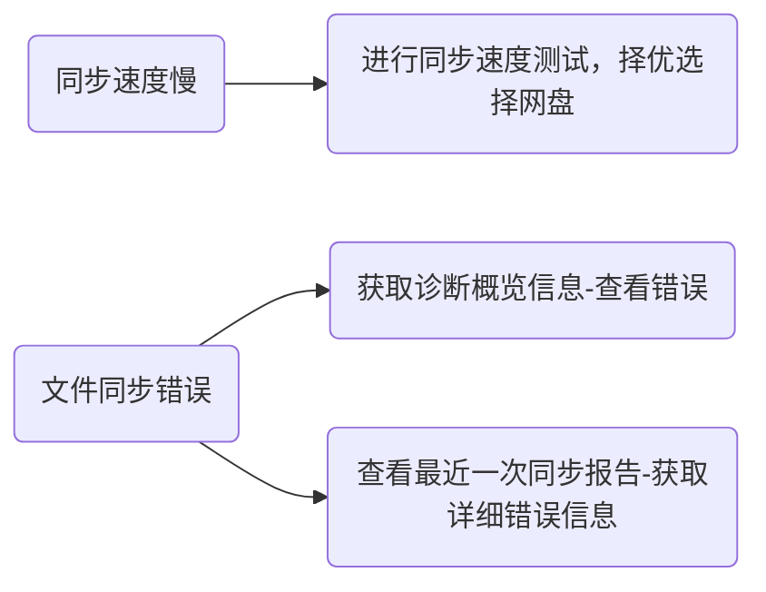

同步过程体验依赖于一些外部环境，比如
1. 网络稳定性影响同步的稳定性。
2. 网络带宽影响同步速度。
3. 网络拓扑影响点对点的连接能力。
4. 网盘帐号等级影响下载速度。

**Sync Vault用户在使用过程中有可以根据需要自行诊断当前同步情况。**


## 获取诊断概览信息
进入【仓库信息】设置页签，点击“诊断”按钮，可以看到诊断信息，包括下面几个部分：
1. 系统信息，可以看到Obsidian版本、Sync Vault版本和当前系统类型。
	```json
	{
	    "platform": "macOS",
	    "obsidianVersion": "obsidian仓库 - Obsidian v1.9.12",
	    "pluginVersion": "0.9.10.beta2"
	}
	```
2. 仓库信息，总文件数，仓库对应的云端路径。
	```json
	{
	    "name": "obsidian仓库",
	    "path": "/apps/obsidian/obsidian仓库",
	    "totalFiles": 513,
	    "configPath": "/apps/obsidian/obsidian仓库"
	}
	```
3. 当前配置，插件相关配置
	```json
	{
		"ignorePattern": "^(新文件夹).*$",
	    "fileSizeLimit": 100,
	    "encryptMode": false,
	    "syncThemes": true,
	    "syncPlugins": true,
	    "showHidden": true
	}
	```
4. 同步状态，包括当前同步模式、网盘、授权码到期时间
	```json
	{
		"mode": "restricted",
	    "isLiveMode": true,
	    "cloudDisk": "baidu",
	    "tokenValid": true,
	    "tokenExpiry": "2025/9/20 11:40:15",
	    "lastSyncTime": null
	}
	```
5. 同步统计，记录了上次同步时间、总同步次数、最近错误
	```json
	{
		"lastSyncTime": null,
	    "totalSyncTimes": 0,
	    "recentErrors": [],
	    "totalFilesProcessed": 0
    }
	```
6. 最近发生的错误
	```json
	{
		"recentErrors": []
	}
	```
## 查看最近一次同步报告
在通过网盘同步的时候，用户可以获取最近一次详细同步记录。具体操作方法可以参考 [[video-playback-revision-sync-report#查看同步报告|查看同步报告]]。
## 测试同步速度
进入【高级功能】-【Debug】，找到“Cloud Drive Performance”项，点击右侧的Perf按钮，弹出如下界面：
![[cloud-drive-perf-test.png#pic_center|400]]

点击对应网盘的测试按钮可以对网盘速度进行测试。下图为**商场公共wifi环境下，非网盘会员速度**体验：
![[cloud-speed-test-report.png|400]]

- 下载速度：当前环境下文件下载速度。
- 上传速度：当前环境下文件上传速度。
- 时延：网盘API的访问时延，基本可以等价于一次同步所需要的最小时延。

关于各个网盘的详细同步性能分析，可以[[performance|点击此处]]查看。