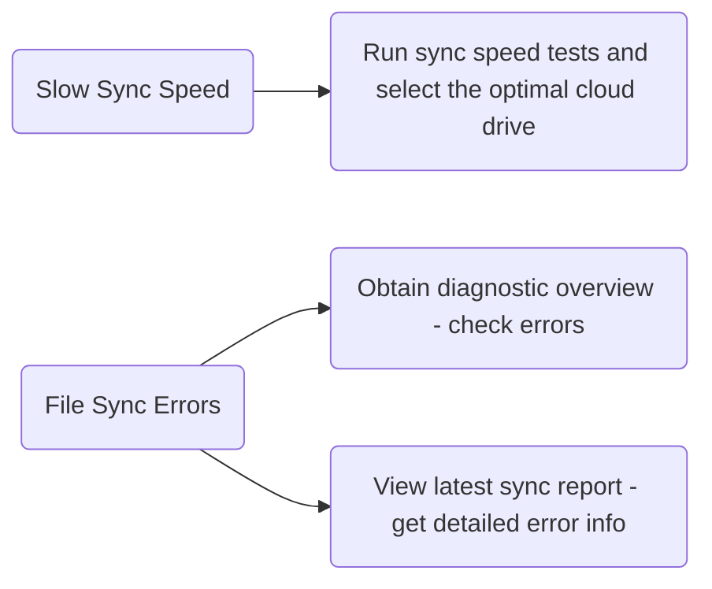

# Frequently Asked Questions (FAQs)

1. **Cloud Drive Authorization Failure**
	
	Check if a network proxy is enabled. Alternatively, open the terminal and refer to [[#View Terminal Error Logs]].
	
2. **No Files Synced to New Devices & No Repository Folder on Cloud Drive**
	
	Verify if the repository name is valid. For details on Baidu Cloud Drive filename symbol restrictions, see [this link](https://www.zhihu.com/question/401747378).
	
3. **Partial File Sync Failure**
    1. Check if the file path contains emojis—emojis are considered invalid characters.
    2. In Automatic Mode, sync failures may occur due to network changes. The system will automatically retry in the next sync cycle.
    3. Try switching to Controlled Mode for manual sync. If manual sync still fails, submit an issue on [Github](https://github.com/abcamus/obsidian-sync-vault-ce) or [Gitee](https://gitee.com/abcamus/obsidian-sync-vault-release), or discuss it in the community group.

# Self-Diagnosis Guide

The sync experience depends on external factors, including:

1. Network stability (affects sync stability).
2. Network bandwidth (affects sync speed).
3. Network topology (affects peer-to-peer connection capability).
4. Cloud drive account tier (affects download speed).

**Sync Vault users can self-diagnose sync issues as needed.**


## Obtain Diagnostic Overview

Go to the **Repository Info** settings tab, click the "Diagnose" button, and view the diagnostic information, which includes the following sections:

1. **System Information**Displays Obsidian version, Sync Vault version, and current system type.
    
    json
    
    ```json
    {
        "platform": "macOS",
        "obsidianVersion": "Obsidian Repository - Obsidian v1.9.12",
        "pluginVersion": "0.9.10.beta2"
    }
    ```
    
2. **Repository Information**Total number of files and the cloud path corresponding to the repository.
    
    ```json
    {
        "name": "Obsidian Repository",
        "path": "/apps/obsidian/Obsidian Repository",
        "totalFiles": 513,
        "configPath": "/apps/obsidian/Obsidian Repository"
    }
    ```
    
3. **Current Configuration**Plugin-related settings.

    ```json
    {
         "ignorePattern": "^(New Folder).*$",
         "fileSizeLimit": 100,
         "encryptMode": false,
         "syncThemes": true,
         "syncPlugins": true,
         "showHidden": true
    }
    ```
    
4. **Sync Status**Includes current sync mode, cloud drive, and authorization code expiration time.
    
    ```json
    {
         "mode": "restricted",
         "isLiveMode": true,
         "cloudDisk": "baidu",
         "tokenValid": true,
         "tokenExpiry": "2025/9/20 11:40:15",
         "lastSyncTime": null
    }
    ```
    
5. **Sync Statistics**Records last sync time, total sync attempts, and recent errors.
    
    ```json
    {
         "lastSyncTime": null,
         "totalSyncTimes": 0,
         "recentErrors": [],
         "totalFilesProcessed": 0
    }
    ```
    
6. **Recent Errors**
    
    ```json
    {
         "recentErrors": []
    }
    ```
    

## View the Latest Sync Report

During cloud drive sync, users can access the detailed record of the latest sync. For specific operations, refer to [[features/sync-report | View Sync Report]].

## Test Sync Speed

1. Go to **Advanced Features** > **Debug**.
2. Locate the "Cloud Drive Performance" section and click the "Perf" button on the right. The following interface will pop up:![[cloud-drive-perf-test.webp#pic_center|400]]
3. Click the test button for the corresponding cloud drive to test its speed. The image below shows the speed experience for **non-cloud drive members on public mall WiFi**:![[cloud-speed-test-report.webp|400]]

- **Download Speed**: File download speed in the current environment.
- **Upload Speed**: File upload speed in the current environment.
- **Latency**: Access latency of the cloud drive API, which is roughly equivalent to the minimum latency required for one sync.

For detailed sync performance analysis of each cloud drive, click [[guides/performance|here]].

## View Terminal Error Logs

Open the Obsidian terminal to check for errors:

- macOS: Press `cmd+option+i`
- Windows: Press `ctrl+shift+I`