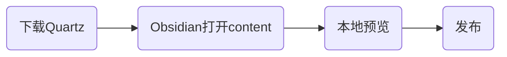

[Quartz](https://quartz.jzhao.xyz/)是一个用于将Markdown发布成静态网站的软件框架。quartz兼容了[Obsidian语法](https://quartz.jzhao.xyz/plugins/ObsidianFlavoredMarkdown)，比如：
- wiki链接形式
- 高亮
- 标注
- mermaid
- tag
等等。因此常和Obsidian结合用来一站式发布知识库。

## 基础流程

### 下载Quartz
```sh
$ git clone https://github.com/jackyzha0/quartz.git
$ cd quartz
$ npm i
$ npx quartz create
```
### 用Obsidian创建知识库
用Obsidian打开quartz目录中的content目录作为Vault，然后在Obsidian中尽情创作即可。
### 本地预览
执行
```sh
$ npx quartz build --serve
```
然后就可以在浏览器中查看发布效果。
### 发布
经过`npx quartz build`生成了一系列前端文件，位于`public`目录下，发布其实就是将public目录的内容部署到服务器上。这个可以根据不同的服务器，比如Apache、Nginx或者github page，按照不同厂商的说明进行部署即可。

## 注意事项
### 设置合理的文档链接和文档名字
文档链接是和文档路径对应的，比如有一篇文档`A/demo.md`，那么对应的网页页面是`[server]/A/demo`。

默认在目录中显示的文档名字是`demo`。在frontmatter中通过title字段可以修改文档的显示名称，路径名字不受影响。

> 针对中文文档的建议：用英文作为文档名字，title可以写成中文。