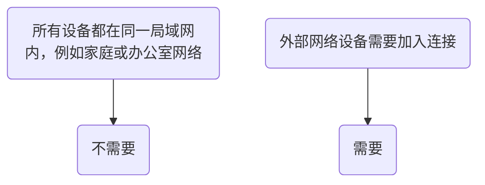

# 什么是 TURN 服务器？

**TURN 服务器** 就像一个“中继站”或“翻译官”，它使位于网络“防火墙”或“NAT”后的设备能够直接通信。当两个设备无法建立直接的“握手”连接时，它们的所有数据都通过这个中间服务器进行中继。在使用 [[zh/sync-modes/peer-to-peer-livesync | 实时同步]] 时，如果设备无法直接发现彼此，就需要 TURN 服务器来中继数据。

## 我需要 TURN 服务器吗？


您可以参考 [[build-turn-server-with-corturn|使用 Coturn 设置 TURN 服务器]] 快速搭建。对于 NAS 用户，请参考 [[build-with-nas|在 NAS 上设置]]。

## 使用 Coturn 设置中继服务

Coturn 是一个强大的开源 STUN/TURN 服务器。

### 1. 准备工作

在开始之前，您需要：

- 一台拥有 **公网 IP 地址** 的服务器（例如云服务器）。
- 服务器上安装了较新的 Linux 发行版（例如 Ubuntu 20.04/22.04 LTS）。

**网络端口要求**：

- **3478 TCP/UDP**：STUN/TURN 服务的标准端口。
- **5349 TCP/UDP**：TURN 服务的 TLS 加密端口。
- **49152-65535 UDP**：用于中继媒体流的端口范围（如果需要，可调整）。

确保您的服务器防火墙（如 `ufw`）或云提供商的安全组规则允许上述端口。例如，在 Ubuntu 上使用 UFW，运行以下命令：

```bash
sudo ufw allow 3478/udp
sudo ufw allow 3478/tcp
sudo ufw allow 5349/udp
sudo ufw allow 5349/tcp
sudo ufw allow 49152:65535/udp # 开放中继端口范围
sudo ufw reload
```

### 2. 安装

**在 Ubuntu/Debian 上，使用 apt 包管理器安装**：

```bash
sudo apt update
sudo apt install coturn
```

### 3. 配置 Coturn

Coturn 的主配置文件通常位于 `/etc/turnserver.conf` 或 `/usr/local/etc/turnserver.conf`。建议先备份原始文件。

|配置项|示例值|描述|
|---|---|---|
|`listening-ip`|`0.0.0.0`|服务器监听的 IP 地址；`0.0.0.0` 表示所有可用的网络接口。|
|`listening-port`|`3478`|STUN/TURN 服务的 UDP/TCP 端口。|
|`tls-listening-port`|`5349`|TURN 服务的 TLS 加密端口。|
|`external-ip`|`您的公网 IP`|**关键！** 您的服务器的公网 IP。如果服务器有多个 IP 或位于 NAT 后，请使用格式 `公网 IP/内网 IP`。|
|`relay-ip`|`服务器内网 IP`|用于中继流量的 IP（通常是服务器的内网 IP）。|
|`min-port`<br><br>`max-port`|`49152`<br><br>`65535`|TURN 中继的 UDP 端口范围。必须与防火墙设置匹配。|
|`user`|`username:password`|长期凭证认证的用户名和密码（明文，用于测试）。|
|`realm`|`yourdomain.com`|领域标识符（通常是您的域名或服务器公网 IP），用于客户端连接。|
|`lt-cred-mech`|(无值)|启用长期凭证认证。|
|`fingerprint`|(无值)|为 STUN/TURN 消息添加指纹属性以增强安全性。|
|`cert`<br><br>`pkey`|`/etc/ssl/turn_cert.pem`<br><br>`/etc/ssl/turn_key.pem`|TLS 证书和私钥的路径（支持 Let’s Encrypt 或自签名证书）。|
|`no-tlsv1`<br><br>`no-tlsv1_1`|(无值)|禁用不安全的 TLS 协议版本。|
|`log-file`|`/var/log/turn.log`|日志文件路径（便于故障排除）。|
|`verbose`|(无值)|启用详细日志输出。|

一个基本的配置文件示例 (`/etc/turnserver.conf`)：

```ini
# 网络监听配置
listening-ip=0.0.0.0
listening-port=3478
tls-listening-port=5349
external-ip=Your Public IP Address # 例如 123.456.789.123
relay-ip=Your Private IP Address   # 例如 172.31.0.10

# 中继端口范围
min-port=49152
max-port=65535

# 域名和认证
realm=Your Domain or Server Public IP # 例如 turn.yourdomain.com
lt-cred-mech
user=Your Username:Your Password # 长期凭证（明文，用于测试）
# 建议使用 turnadmin 创建动态用户：cite[2]
# 或使用 use-auth-secret 和 static-auth-secret：cite[2]

# 安全和 TLS
fingerprint
cert=/etc/ssl/turn_cert.pem    # TLS 证书路径
pkey=/etc/ssl/turn_key.pem     # TLS 私钥路径
no-tlsv1
no-tlsv1_1
cipher-list="DEFAULT"          # 加密套件列表：cite[8]

# 日志
log-file=/var/log/turn.log
verbose # 生产环境中建议禁用，以避免日志过大

# 其他
stale-nonce
no-multicast-peers
no-cli:cite[8]
```

### 4. 启动和测试

**启动 Coturn 服务**：如果通过 `apt` 安装，Coturn 已设置为 systemd 服务。使用以下命令启动并启用它：

```sh
sudo systemctl start coturn    # 启动服务
sudo systemctl enable coturn   # 设置开机自启：cite[10]
```

**检查服务状态和日志**：使用以下命令验证 Coturn 是否正常运行：

```sh
sudo systemctl status coturn   # 检查服务状态
sudo tail -f /var/log/turn.log # 查看实时日志（如果配置了 log-file）：cite[10]
netstat -tuln | grep -E ':(3478|5349)' # 检查端口是否在监听
```

**测试 TURN 服务器**：**在线工具测试**：Google 提供了一个方便的 **WebRTC ICE Candidate 收集测试页面**：

1. 打开浏览器并访问：[https://webrtc.github.io/samples/src/content/peerconnection/trickle-ice/](https://webrtc.github.io/samples/src/content/peerconnection/trickle-ice/)
2. 在 `IceServers` 框中，删除默认内容并按以下格式添加您的 TURN 服务器信息：
    
    ```json
    {
      "urls": "turn:Your Public IP:3478",
      "username": "Your Username",
      "credential": "Your Password"
    }
    ```
    

### 5. Sync Vault 配置

打开 **同步设置** > **自托管配置**，在输入框中输入 TURN 服务器详情：

```sh
// 格式：turn:host:port?username=xxx&password=xxx
```

点击云图标以自动建立点对点连接。

## 在 NAS 上设置中继服务

**NAS** 是托管 TURN 服务器的绝佳平台，特别是对于家庭实验室或个人项目。其 24/7 运行和低功耗特性使其非常适合运行此类持久服务。

[[#使用 Coturn 设置中继服务]] 涵盖了基于 Coturn 的 TURN 服务器设置。对于 NAS 部署，主要有三种方法，取决于您的 NAS 型号和系统：

|方法|适用场景|优点|缺点|
|---|---|---|---|
|**Docker**|**大多数现代 NAS (群晖, 威联通, 极空间等)**|**强烈推荐！** 部署简单，隔离性好，不污染系统，易于管理和迁移。|需要基本的 Docker 知识|
|**原生安装**|支持 `apt` 或 `pkg` 的基于 Linux 的 NAS (如 TrueNAS Scale)|性能略好，直接控制|可能依赖系统版本，有与其他系统组件冲突的风险|
|**虚拟机**|所有支持虚拟化的 NAS|完全隔离，最大的灵活性|资源消耗较高，设置较复杂|

> 🎈 **推荐基于 Docker 的设置**：这是最简单、最安全的方法，适用于大多数 NAS 品牌，如群晖 (DSM)、威联通 (QNAP) 和华硕。

### 1. 准备工作

- **启用 SSH 访问**：在您的 NAS 控制面板中激活 SSH，以便通过终端执行命令。
- **安装 Docker**：在您的 NAS 套件中心或应用中心搜索并安装 **Docker** 应用（例如群晖的 "Container Manager"）。
- **规划文件路径**：在您的 NAS 上创建一个文件夹来存储 Coturn 的配置文件和日志（例如 `/docker/coturn`）。

### 2. 创建配置文件

通过 SSH 连接到您的 NAS 或使用 NAS 内置的文本编辑器，在刚才创建的文件夹（例如 `/docker/coturn`）中创建一个名为 `turnserver.conf` 的文件：