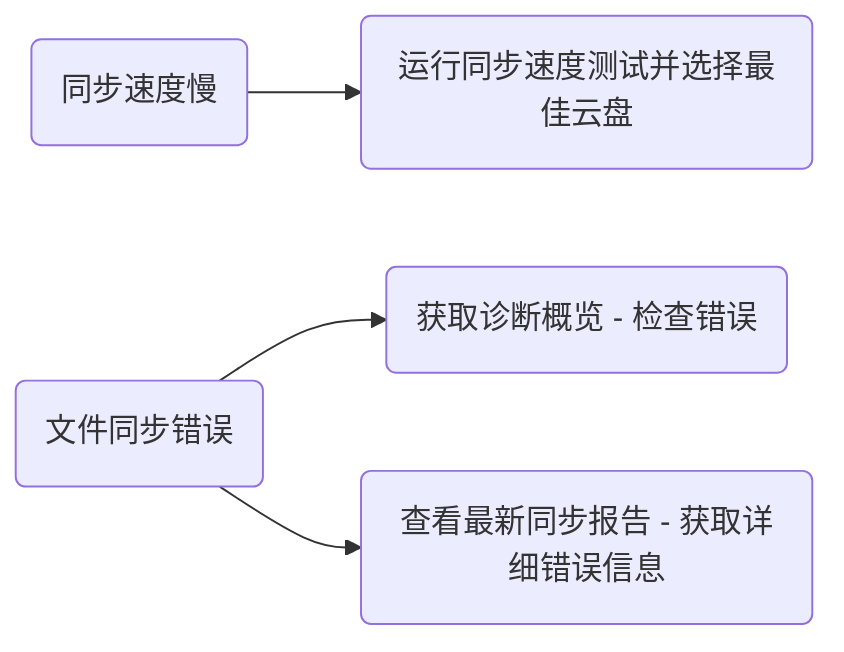

# 常见问题解答 (FAQs)

1. **云盘授权失败**
	
	请检查是否开启了网络代理。或者打开终端，参考 [[#查看终端错误日志]]。
	
2. **新设备未同步文件 & 云盘上没有仓库文件夹**
	
	请验证仓库名称是否有效。关于百度网盘文件名符号限制的详情，请参考 [此链接](https://www.zhihu.com/question/401747378)。
	
3. **部分文件同步失败**
    1. 检查文件路径是否包含 Emoji —— Emoji 被视为无效字符。
    2. 在自动模式下，由于网络波动可能会导致同步失败。系统将在下一个同步周期自动重试。
    3. 尝试切换到受限模式进行手动同步。如果手动同步仍然失败，请在 [Github](https://github.com/abcamus/obsidian-sync-vault-ce) 或 [Gitee](https://gitee.com/abcamus/obsidian-sync-vault-release) 上提交 Issue，或在社区群中讨论。

# 自我诊断指南

同步体验取决于外部因素，包括：

1. 网络稳定性（影响同步稳定性）。
2. 网络带宽（影响同步速度）。
3. 网络拓扑（影响点对点连接能力）。
4. 云盘账户等级（影响下载速度）。

**Sync Vault 用户可以根据需要自行诊断同步问题。**


## 获取诊断概览

转到 **仓库信息** 设置标签页，点击 "Diagnose" (诊断) 按钮，查看诊断信息，包括以下部分：

1. **系统信息**：显示 Obsidian 版本、Sync Vault 版本和当前系统类型。
    
    ```json
    {
        "platform": "macOS",
        "obsidianVersion": "Obsidian Repository - Obsidian v1.9.12",
        "pluginVersion": "0.9.10.beta2"
    }
    ```
    
2. **仓库信息**：文件总数和仓库对应的云端路径。
    
    ```json
    {
        "name": "Obsidian Repository",
        "path": "/apps/obsidian/Obsidian Repository",
        "totalFiles": 513,
        "configPath": "/apps/obsidian/Obsidian Repository"
    }
    ```
    
3. **当前配置**：插件相关设置。

    ```json
    {
         "ignorePattern": "^(New Folder).*$",
         "fileSizeLimit": 100,
         "encryptMode": false,
         "syncThemes": true,
         "syncPlugins": true,
         "showHidden": true
    }
    ```
    
4. **同步状态**：包括当前同步模式、云盘和授权码过期时间。
    
    ```json
    {
         "mode": "restricted",
         "isLiveMode": true,
         "cloudDisk": "baidu",
         "tokenValid": true,
         "tokenExpiry": "2025/9/20 11:40:15",
         "lastSyncTime": null
    }
    ```
    
5. **同步统计**：记录上次同步时间、总同步尝试次数和最近错误。
    
    ```json
    {
         "lastSyncTime": null,
         "totalSyncTimes": 0,
         "recentErrors": [],
         "totalFilesProcessed": 0
    }
    ```
    
6. **最近错误**
    
    ```json
    {
         "recentErrors": []
    }
    ```
    

## 查看最新同步报告

在云盘同步期间，用户可以访问最新同步的详细记录。具体操作请参考 [[zh/features/sync-report | 查看同步报告]]。

## 测试同步速度

1. 转到 **高级功能** > **调试**。
2. 找到 "Cloud Drive Performance" (云盘性能) 部分，点击右侧的 "Perf" 按钮。将弹出以下界面：![[cloud-drive-perf-test.webp#pic_center|400]]
3. 点击相应云盘的测试按钮以测试其速度。下图显示了 **非云盘会员在商场公共 WiFi** 下的速度体验：![[cloud-speed-test-report.webp|400]]

- **Download Speed** (下载速度)：当前环境下的文件下载速度。
- **Upload Speed** (上传速度)：当前环境下的文件上传速度。
- **Latency** (延迟)：云盘 API 的访问延迟，大致相当于一次同步所需的最小延迟。

关于每个云盘的详细同步性能分析，请点击 [[guides/performance|这里]]。

## 查看终端错误日志

打开 Obsidian 终端以检查错误：

- macOS: 按 `cmd+option+i`
- Windows: 按 `ctrl+shift+I`