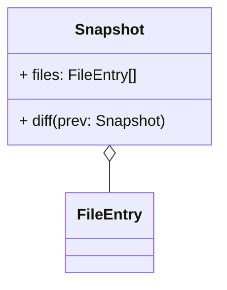
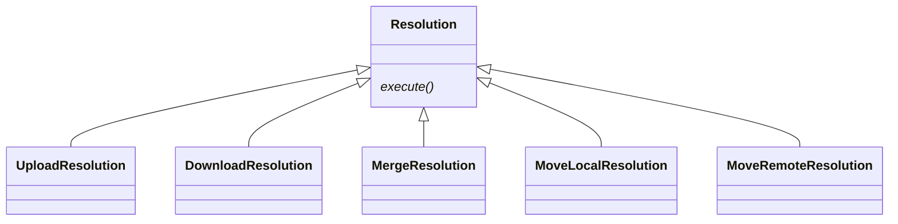
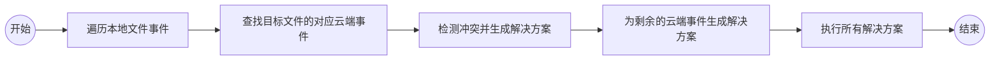
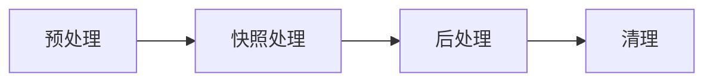

Sync Vault 提供文件级的冲突检测与解决能力。这是解释其技术基础的第二篇文章——重点关注如何识别、处理和解决云端事件。

在上一篇文章 [[zh/technical/local file events | 处理本地事件]] 中，我们探讨了 Obsidian 中本地事件的触发机制、特征和处理方法。我们得出的结论是，在发生 `create` (创建)、`modify` (修改)、`delete` (删除) 或 `rename` (重命名) 事件后，会启动与云端的同步。

在深入研究之前，让我们先解决一个关键问题：如果在此过程中云端文件也发生了变化怎么办？本文将通过涵盖云端事件识别、冲突识别和解决策略来回答这个问题。

## 获取云端事件
对于同步，我们关注四个核心文件事件：创建、修改、删除和移动——同样适用于云端文件。

云端事件的获取取决于云服务的能力，分为两种情况：

1. **具有变更跟踪 API 的云服务**：像 OneDrive 这样的服务提供 Delta API 来查询自上次同步以来的变更，或通过 Webhook 通知客户端文件更新。这极大地简化了同步实现。
2. **仅提供存储的云服务**：像百度网盘或阿里云盘这样的服务仅提供基本的文件存储（无变更跟踪 API）。下面我们重点介绍这种情况下的同步实现。

### 文件表示
我们使用 `FileEntry` 接口来建模文件对象，其中 `fsid` 作为关键的唯一标识符（即使文件被修改或移动也不变）：

```ts
interface FileEntry {
  path: string; // 绝对文件路径
  isdir: boolean;
  fsid: string; // 不可变的唯一 ID
  parentFileId?: string;
  ctime: number; /* 创建时间 (秒) */
  mtime: number; /* 修改时间 (秒) */
  size: number; /* 文件大小 (字节) */
}
```

### 任意时刻的云端快照
`Snapshot` 类型表示云端在特定时刻的文件状态，由 `FileEntry` 对象组成：

### 识别云端变更

云端变更是通过比较两个连续的快照得出的：`cloudChanges = diff(currentCloudSnapshot, prevCloudSnapshot)`

下表概述了如何检测特定事件：

|文件事件|检测逻辑 (两个快照之间)|
|---|---|
|移动|相同的 `fsid`，不同的 `path`|
|删除|文件路径存在于上一个快照中，但不存在于当前快照中|
|修改|相同的 `path` + (不同的云端哈希 (理想情况) 或 改变的 `mtime`/`size` (回退方案))|

> [!note] 特殊情况：云端文件创建
> 我们不比较两个云端快照，而是直接比较当前云端快照与本地文件。如果云端文件的路径在本地不存在，则它是新创建的云端文件。

## 处理云端事件

我们实现一个 `apply` 方法来处理云端事件。从 [[zh/technical/local file events | 处理本地事件]] 中，我们已经有了预处理后的本地文件事件，存储在 `historyEvents` 中——一个 `FileEvent` 对象的集合：

```ts
interface FileEvent {
  type: FileEventTypeEnum; /* create/modify/delete/move */
  targetPath: string;
  isDir: boolean;
  oldPath?: string; /* 用于重命名事件 */
  timestamp: number;
  mark: ResolveStatus; /* 用于冲突解决 */
}
```

### 同步状态初始化与冲突检测

> [!important] 通过协调本地和云端事件进行冲突检测是可靠同步的基石。

#### 步骤 1：同步状态初始化

在每次同步开始时：

1. 生成本地和云端文件的并集。
2. 设置初始状态：
    - 仅本地文件：`LocalCreated`
    - 仅云端文件：`RemoteCreated`
    - 两者都存在的文件：使用 `checkFileNodeSyncStatus(localFile, remoteFile)` 确定初始同步状态。

#### 步骤 2：冲突检测

本地和云端事件分别存储在 Map 中（键：文件路径，值：事件）。通过协调这些事件来识别冲突，伪代码如下：`resolve(localEvent, remoteEvent): Resolution`

我们定义了 5 种 `Resolution` (解决方案) 类型来指示如何解决冲突（每种都实现了 `execute()` 方法）：



下表将事件组合映射到相应的解决方案（针对多设备同步）：

| 本地事件 \ 云端事件 | 修改 (Modify)         | 移动 (Move)           | 删除 (Delete) |
| ------------------------- | --------------------- | --------------------- | ----------- |
| 修改 (Modify)             | 合并 (Merge)          | 移动本地 + 上传       | 上传        |
| 移动 (Move)               | 移动云端 + 下载       | 下载 + 上传[^1]       | 上传[^2]    |
| 删除 (Delete)             | 下载[^3]              | 下载                  | 无冲突      |

#### 步骤 3：冲突解决工作流



#### 步骤 4：解决后状态更新
解决冲突后，文件同步状态更新如下：

|解决方案类型|操作与状态更新|
|---|---|
|Upload (上传)|上传本地文件；标记为 `Synced` (已同步)|
|Download (下载)|下载云端文件；更新本地状态|
|Merge (合并)|获取云端内容；与本地文件合并|
|MoveLocal (移动本地)|移动本地文件；标记为 `Synced`|
|MoveRemote (移动云端)|移动云端文件；标记为 `Synced`|

保持在 `LocalCreated` 或 `RemoteCreated` 状态的文件是真正的新文件，将直接同步（上传/下载）。

## 同步工作流总结
完整的同步过程包括 4 个阶段：



1. **预处理**：获取最新的云端快照并初始化同步状态。
2. **快照处理**：检测云端变更，识别冲突，并执行解决方案。
3. **后处理**：同步未处理的文件（真正的新文件）。
4. **清理**：重置临时状态并为下一个同步周期做准备。

这种文件级冲突解决机制使得在仅提供存储的云服务上实现可靠同步成为可能。对于更细粒度的协作（例如实时协同编辑），需要 CRDT 等高级技术。Sync Vault 实现了 CRDT 以将协同编辑引入 Obsidian——敬请期待我们的下一篇文章！

[^1]: 如果文件被移动到不同的路径，则会发生冲突；如果冲突，将保留两个版本。如果移动到相同的路径，则无冲突。
[^2]: 本地文件被保留（优先考虑本地变更）。
[^3]: 本地删除被覆盖；下载云端文件（对于修改事件，优先考虑云端变更）。